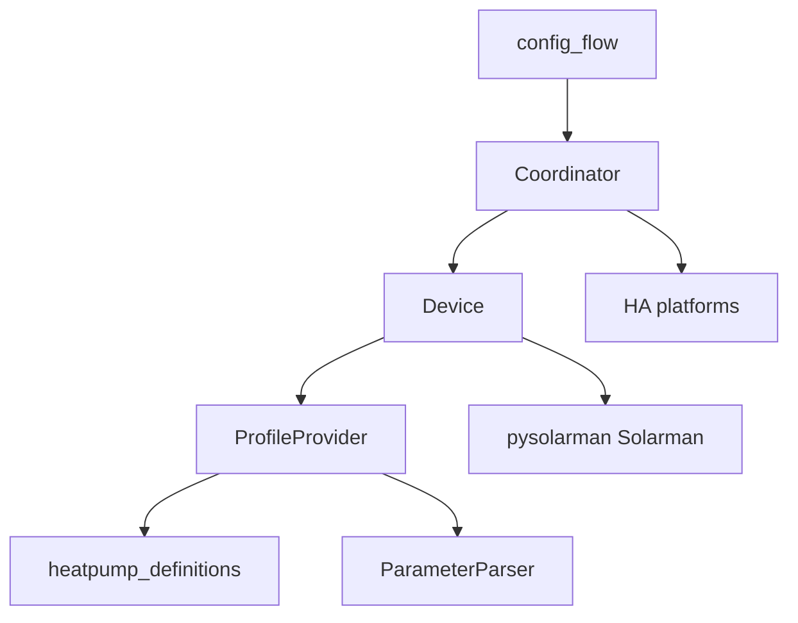

# Architecture

Declarative **YAML profile** + async Modbus client. Device-specific behavior lives in `heatpump_definitions/`; Python is the reusable engine.

## Module map

| Module | Role |
|--------|------|
| [`__init__.py`](../custom_components/heatman/__init__.py) | Setup, platform forwarding |
| [`config_flow.py`](../custom_components/heatman/config_flow.py) | User and options flows |
| [`coordinator.py`](../custom_components/heatman/coordinator.py) | 5s `DataUpdateCoordinator` |
| [`device.py`](../custom_components/heatman/device.py) | Connection and bulk reads |
| [`provider.py`](../custom_components/heatman/provider.py) | Config, endpoint, profile load |
| [`parser.py`](../custom_components/heatman/parser.py) | Scheduling and decode rules |
| [`entity.py`](../custom_components/heatman/entity.py) | `HeatmanEntity` / writable base |
| Platforms | sensor, binary_sensor, switch, number, select, button, datetime, time |
| [`services.py`](../custom_components/heatman/services.py) | Raw Modbus services |
| [`pysolarman/`](../custom_components/heatman/pysolarman/) | Vendored Modbus client (internal name) |

## Poll loop

- Coordinator interval: **5 seconds** (`TIMINGS_INTERVAL`)
- Profile items declare `update_interval` (seconds); scheduled when the runtime counter divides evenly
- Registers are batched (`min_span` / `max_size`)
- Decoded values land in coordinator data; entities refresh from that

## Defaults

Port **502**, transport **`modbus_tcp`**, default profile **`midea_mthermal_a.yaml`**, device name **Heat Pump**.
